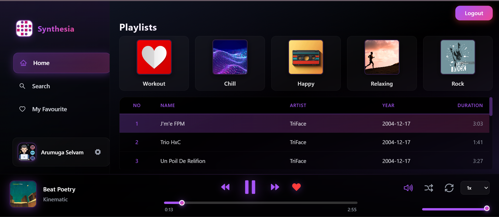

# WSA Synthesia App

**Synthesia App** is a real-time music player application built using the **MERN stack** with **authentication** for user details and **jamendo api** for songs fetching.  
It allows users to sign up, log in, play songs and add songs in favourite sections.

---

## 🛠️ Tech Stack

<p align="left">
  
  
  
  
  
  
   
  
</p>

---

## ✨ Key Features

 

- **ImageKit Integration** – Store and serve chat images from the cloud  


---

## Screenshot:


**Live Demo** : [Click here to view the app](https://wsa-synthesia-app.netlify.app/)

---

## 📁 Folder Structure
├── frontend  
└── backend  

- **frontend/** → React app with Reduxjs/toolkit, TailwindCSS.  
- **backend/** → Node.js & Express server,MongoDB.  

---

## 📌 How to Run Locally

1️⃣ **Clone the Repository:**
```bash
git clone <REPOSITORY_URL>
cd wsa-chatty-app
```
2️⃣ **Install Dependencies:**
```
# Frontend
cd frontend
npm install

# Backend
cd ../backend
npm install

```
3️⃣ **Configure Environment Variables:**
<br><br>
Backend (.env)
```
PORT=5000
MONGODB_URL=your_mongodb_connection_string
clientId=jamendo_client_id

MAILTRAP_HOST=sandbox.smtp.mailtrap.io
MAILTRAP_PORT=2525
MAILTRAP_USER=your_mailtrap_userName
MAILTRAP_PASS=your_mailtrap_password

IMAGEKIT_PUBLIC_KEY=your_imagekit_public_key
IMAGEKIT_PRIVATE_KEY=your_imagekit_private_key
IMAGEKIT_URL_ENDPOINT=your_imagekit_url_endpoint
```
Frontend (.env)
VITE_API_URL=https://wsa-mern-music-player-app.onrender.com
JAMENDO_CLIENT_ID=jamendo_client_id
```
4️⃣ **Run the Application:**
```
# Backend
cd backend
npm start

# Frontend
cd ../frontend
npm run dev
```

## 📄 License
© 2025 WSA. All rights reserved.
